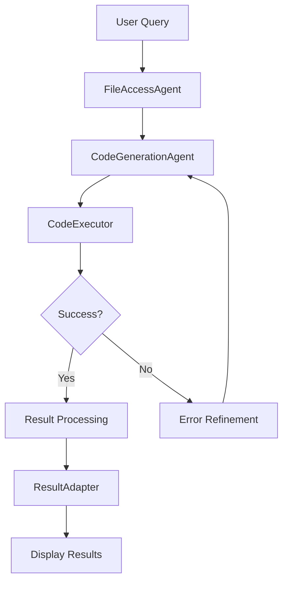

# 🤖 AgenticDataAnalyst

> An AI-powered data analysis platform that converts natural language queries into executable Python code and runs it securely.

[](https://www.python.org/)
[](https://streamlit.io/)
[](LICENSE)
[](https://github.com)

**Fully functional and Streamlit Cloud compatible!** The system uses LangGraph for workflow orchestration, Google Gemini for code generation, and codibox for secure code execution with dual backend support (Host/Docker).

## ✨ Features

- 🧠 **Natural Language to Code**: Converts user queries into executable Python code using AI
- 🔍 **Intelligent File Selection**: Automatically selects relevant datasets using semantic search
- ⚡ **Dual Backend Execution**: 
  - **Host backend** (default): Fast execution, works on Streamlit Cloud
  - **Docker backend** (optional): Secure, isolated execution for local development
- 📊 **Visualization Generation**: Automatically creates charts and visualizations
- 🔄 **Error Recovery**: Automatic code refinement with up to 3 retry attempts
- 🤖 **AI-Powered Metadata**: Generates dataset descriptions and summaries automatically
- 🌐 **Multiple Interfaces**: CLI, Streamlit web app, and programmatic API

## Project Structure

```
AgenticDataAnalyst/
├── agent_coder/              # AI workflow system
│   ├── agents.py             # FileAccessAgent, CodeGenerationAgent, CodeExecutor
│   ├── workflow.py           # LangGraph workflow definitions
│   ├── simple_workflow.py    # Enhanced workflow with result processing
│   ├── utils.py              # Utility functions for CSV analysis
│   └── main.py               # CLI interface
├── datasets/                 # Data files and metadata
│   ├── *.csv                 # Sample datasets
│   └── metadata.json         # Dataset descriptions
├── docker/                   # Docker configuration (optional)
│   ├── Dockerfile            # Container definition
│   └── requirements.txt      # Python packages for container
├── scripts/                  # Setup and utility scripts
│   ├── setup_gemini.py       # Gemini API key setup
│   ├── setup_docker.py       # Docker container setup
│   ├── check_docker.py       # Docker status checker
│   ├── download_datasets.py  # Download sample datasets
│   └── create_metadata.py    # Generate dataset metadata
├── streamlit_app.py          # Web dashboard
├── setup_project.py          # Main project setup script
├── requirements.txt          # All project dependencies
└── README.md                 # This file
```

## 📋 Table of Contents

- [Features](#-features)
- [Architecture](#-architecture)
- [Quick Start](#-quick-start)
- [Installation](#-installation)
- [Usage](#-usage)
- [Configuration](#-configuration)
- [Streamlit Cloud Deployment](#-streamlit-cloud-deployment)
- [Troubleshooting](#-troubleshooting)
- [Development](#-development)
- [Contributing](#-contributing)

## 🏗️ Architecture

### Core Components

1. **FileAccessAgent**: Selects appropriate data files based on user queries using semantic search
2. **CodeGenerationAgent**: Generates Python code using LLM (Gemini/OpenAI)
3. **CodeExecutor**: Executes code with dual backend support (Host/Docker) and error handling
4. **Workflow**: LangGraph-based orchestration of agents

### Execution Flow



**Text Flow:**
```
User Query
    ↓
FileAccessAgent (selects dataset via semantic search)
    ↓
CodeGenerationAgent (generates Python code using LLM)
    ↓
CodeExecutor (executes code - Host or Docker backend)
    ↓
Error Handling (automatic refinement if errors occur)
    ↓
Result Processing (extracts images, CSV files, markdown)
    ↓
ResultAdapter (formats results for display)
    ↓
Display Results (Streamlit UI)
```

## 🚀 Quick Start

### Prerequisites

- Python 3.10+
- Google Gemini API key ([Get one here](https://aistudio.google.com/app/apikey))
- Docker (optional, only if using Docker backend)

### Installation

1. **Clone the repository:**
   ```bash
   git clone https://github.com/yourusername/AgenticDataAnalyst.git
   cd AgenticDataAnalyst
   ```

2. **Install dependencies:**
   ```bash
   pip install -r requirements.txt
   ```
   This will install all dependencies including `codibox` from pip.

3. **Set up Gemini API key:**
   ```bash
   python scripts/setup_gemini.py
   ```
   Or create a `.env` file with:
   ```env
   GOOGLE_API_KEY=your_key_here
   ```
   For Streamlit Cloud, set the key in Streamlit secrets.

4. **Download sample datasets (optional):**
   ```bash
   python scripts/download_datasets.py
   ```

5. **Set up Docker container (optional, only if using Docker backend):**
   ```bash
   python scripts/setup_docker.py
   ```
   Or set `USE_DOCKER_BACKEND=true` environment variable.

### Running the Application

**Streamlit Web App (Recommended):**
```bash
streamlit run streamlit_app.py
```
Then open your browser to `http://localhost:8501`

**CLI Interface:**
```bash
python -m agent_coder.main
```

## 💻 Usage

### Streamlit App

1. Start the app: `streamlit run streamlit_app.py`
2. Select a dataset from the sidebar (or upload your own CSV)
3. Enter a natural language query (e.g., "Show me sales trends by region")
4. View generated charts and results

### Programmatic Usage

```python
from agent_coder.simple_workflow import process_query, simple_coder

# Process a query
result = process_query(simple_coder, "Show me sales trends by region")

# Access results
print(result["messages"][-1].content)
```

### Example Queries

- "Create a scatter plot of sepal length vs sepal width colored by species"
- "Show me the survival rate by passenger class"
- "Visualize the age distribution of customers"
- "Compare average sales across different regions"

## ⚙️ Configuration

### LLM Models

The system uses Google Gemini by default, with OpenAI as fallback:

| Model | Status | Use Case |
|-------|--------|----------|
| `gemini-2.5-flash-lite` | ✅ Preferred | Default for all agents |
| `gpt-4o-mini` | 🔄 Fallback | Used if Gemini unavailable |

### Execution Backends

| Feature | Host Backend (Default) | Docker Backend (Optional) |
|---------|----------------------|-------------------------|
| **Speed** | ~0.5-2 seconds | ~2-5 seconds |
| **Streamlit Cloud** | ✅ Works | ❌ Not supported |
| **Security** | ⚠️ User permissions | ✅ Isolated container |
| **Setup** | ✅ Auto-install deps | ⚠️ Requires Docker |
| **Network** | ✅ Full access | ❌ No network access |

**To use Docker backend:**
```bash
export USE_DOCKER_BACKEND=true
```

## Dependencies

### Core Libraries
- `langchain` - LLM orchestration
- `langgraph` - Workflow management
- `langchain-google-genai` - Gemini integration
- `pandas`, `numpy` - Data manipulation
- `matplotlib`, `seaborn` - Visualization
- `streamlit` - Web interface

### Docker Container Packages
- Jupyter, nbconvert - Notebook execution
- Data science libraries (pandas, numpy, matplotlib, seaborn)
- Machine learning libraries (scikit-learn, statsmodels)

## Troubleshooting

### Import Errors

If you see `ImportError: No module named 'codibox'`:
- Install dependencies: `pip install -r requirements.txt`
- The codibox package should be installed automatically from pip

### Docker Container Issues (if using Docker backend)

Check container status:
```bash
python scripts/check_docker.py
```

Or manually:
```bash
docker ps -a | grep sandbox
docker start sandbox
```

### API Key Issues

Ensure your API key is set:
```bash
python scripts/setup_gemini.py
```

Or check `.env` file exists with `GOOGLE_API_KEY`.

For Streamlit Cloud:
- Set `GOOGLE_API_KEY` in Streamlit Cloud secrets dashboard

### Backend Selection

The app uses **Host backend by default** (works everywhere). To use Docker:
- Set environment variable: `export USE_DOCKER_BACKEND=true`
- Or in Streamlit Cloud secrets: `USE_DOCKER_BACKEND = "true"`

## ☁️ Streamlit Cloud Deployment

The app is fully compatible with Streamlit Cloud! Follow these steps:

### Step 1: Push to GitHub
```bash
git add .
git commit -m "Initial commit"
git push origin main
```

### Step 2: Deploy on Streamlit Cloud
1. Go to [share.streamlit.io](https://share.streamlit.io)
2. Click "New app"
3. Connect your GitHub repository
4. Set main file path: `streamlit_app.py`

### Step 3: Configure Secrets
In Streamlit Cloud dashboard, go to Settings → Secrets and add:
```toml
GOOGLE_API_KEY = "your-api-key-here"
```

### What Works Automatically
- ✅ Works without Docker
- ✅ Auto-installs dependencies
- ✅ Uses Host backend by default
- ✅ Handles secrets securely
- ✅ No additional configuration needed

## 🛠️ Development

### Project Status

✅ **Production Ready**: Fully functional and tested

### Current Features

- ✅ Natural language to code generation
- ✅ Dual backend support (Host/Docker)
- ✅ Streamlit Cloud compatible
- ✅ AI-powered metadata generation
- ✅ Automatic error recovery
- ✅ Image and CSV extraction

### Roadmap

- [ ] Add unit tests
- [ ] Improve error messages
- [ ] Add result caching
- [ ] Support for multiple file inputs
- [ ] Enhanced visualization options
- [ ] Performance optimizations

### Tech Stack

- **LLM**: Google Gemini 2.5 Flash Lite (OpenAI fallback)
- **Framework**: LangChain + LangGraph
- **Execution**: codibox (Host/Docker backends)
- **Web**: Streamlit
- **Data**: pandas, numpy, matplotlib, seaborn

## 📄 License

This project is licensed under the MIT License - see the [LICENSE](LICENSE) file for details.

## 🤝 Contributing

Contributions are welcome! Please feel free to submit a Pull Request.

1. Fork the repository
2. Create your feature branch (`git checkout -b feature/AmazingFeature`)
3. Commit your changes (`git commit -m 'Add some AmazingFeature'`)
4. Push to the branch (`git push origin feature/AmazingFeature`)
5. Open a Pull Request

## 📞 Support

- **Issues**: [GitHub Issues](https://github.com/yourusername/AgenticDataAnalyst/issues)
- **Discussions**: [GitHub Discussions](https://github.com/yourusername/AgenticDataAnalyst/discussions)

## ⭐ Star History

If you find this project useful, please consider giving it a star!

---

**Made by Otmane El Bourki**
